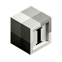
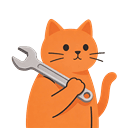
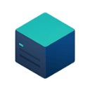
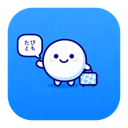
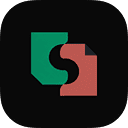
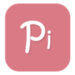
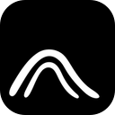
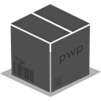

# BackRunner

**Independent product builder at the intersection of interface craft, AI tooling, and the small web.**

I make focused tools that feel calm, capable, and a little more human.

PRODUCTS &nbsp;&middot;&nbsp; INTERFACES &nbsp;&middot;&nbsp; AGENT WORKFLOWS &nbsp;&middot;&nbsp; INDEPENDENT WEB

## Selected Work

<table width="100%">
  <tr>
    <td width="64" align="center">
      
    </td>
    <td valign="middle">
      <strong><a href="https://iconwiz.app">Iconwiz</a></strong> 
      An AI icon generator for polished, platform-ready assets.
    </td>
  </tr>
  <tr>
    <td width="64" align="center">
      
    </td>
    <td valign="middle">
      <strong><a href="https://skills.cat">SkillsCat</a></strong> 
      A home for discovering and sharing AI agent skills.
    </td>
  </tr>
  <tr>
    <td width="64" align="center">
      
    </td>
    <td valign="middle">
      <strong><a href="https://github.com/backrunner/Serlink">Serlink</a></strong> 
      A focused SSH workspace for remote sessions.
    </td>
  </tr>
  <tr>
    <td width="64" align="center">
      
    </td>
    <td valign="middle">
      <strong><a href="https://github.com/backrunner/sift">sift</a></strong> 
      A native iOS junk filter built for a quieter inbox.
    </td>
  </tr>
</table>

## Project Dock

<table width="100%">
  <tr>
    <td align="center" width="33%">
      <a href="https://tabitomo.alkinum.io">
        
         
        <strong>Tabitomo</strong>
      </a>
       
      Travel translator
    </td>
    <td align="center" width="33%">
      <a href="https://svedocs.pwp.sh">
        
         
        <strong>SveDocs</strong>
      </a>
       
      Svelte docs framework
    </td>
    <td align="center" width="33%">
      <a href="https://anyui.pwp.sh">
        
         
        <strong>AnyUI</strong>
      </a>
       
      Cute UI components
    </td>
  </tr>
  <tr>
    <td align="center" width="33%">
      <a href="https://pixiviz.pwp.app">
        
         
        <strong>Pixiviz</strong>
      </a>
       
      ACG image sharing
    </td>
    <td align="center" width="33%">
      <a href="https://github.com/QuaDevTeam/QuaEngine">
        
         
        <strong>QuaEngine</strong>
      </a>
       
      Visual novel engine
    </td>
    <td align="center" width="33%">
      <a href="https://github.com/alkinum/alphapush">
        
         
        <strong>AlphaPush</strong>
      </a>
       
      Web push PWA
    </td>
  </tr>
</table>

## Community

<table width="100%">
  <tr>
    <td width="72" align="center">
      
    </td>
    <td valign="middle">
      <strong><a href="https://pwp.space">pwp.space</a></strong> 
      A small Misskey community for project talk, web craft, strange ideas, and a calmer timeline.
       
      <a href="https://pwp.space">Visit the community</a> &middot; <a href="https://pwp.space/@backrunner">Follow @backrunner</a>
    </td>
  </tr>
</table>

## How I Build

Calm first, clever second. I care about clear empty states, short paths through messy workflows, and small details that make software feel considered without getting in the way.

  

## Say Hello

Working on AI agents, design tooling, front-end systems, or independent social spaces? I would be happy to compare notes.

  
  
  

