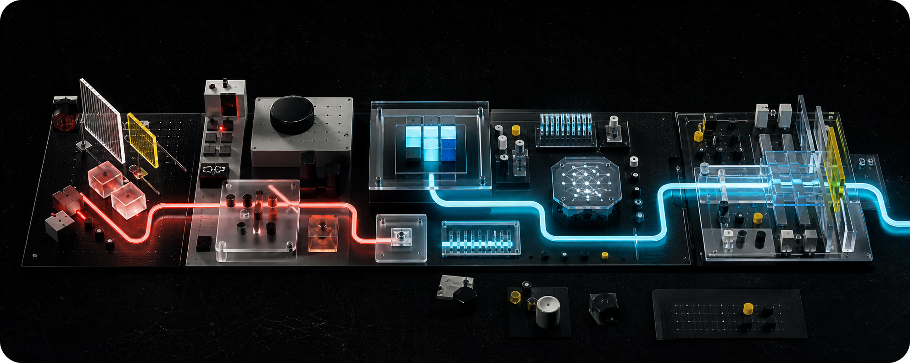

# BackRunner

**Independent product builder at the intersection of interface craft, AI tooling, and the small web.**

I design and ship focused tools that turn complicated workflows into calm, capable interfaces. Each project starts small, earns its details, and stays close to the people using it.

<sub>PRODUCTS &nbsp;&middot;&nbsp; INTERFACES &nbsp;&middot;&nbsp; AGENT WORKFLOWS &nbsp;&middot;&nbsp; INDEPENDENT WEB</sub>

<p>
  <a href="https://pwp.space/@backrunner"></a>
  <a href="mailto:dev@backrunner.top"></a>
</p>

## Selected Work

<table width="100%">
  <tr>
    <td width="72" valign="top">
      <a href="https://iconwiz.app"></a>
    </td>
    <td valign="top">
      <strong><a href="https://iconwiz.app">Iconwiz</a></strong><br />
      An AI icon generator for polished, platform-ready assets.<br />
      <sub>GENERATIVE DESIGN &nbsp;&middot;&nbsp; ICON SYSTEMS &nbsp;&middot;&nbsp; DESKTOP</sub>
    </td>
  </tr>
  <tr>
    <td width="72" valign="top">
      <a href="https://skills.cat"></a>
    </td>
    <td valign="top">
      <strong><a href="https://skills.cat">SkillsCat</a></strong><br />
      A home for discovering and sharing practical AI agent skills.<br />
      <sub>AGENT ECOSYSTEM &nbsp;&middot;&nbsp; DISCOVERY &nbsp;&middot;&nbsp; CLOUD</sub>
    </td>
  </tr>
  <tr>
    <td width="72" valign="top">
      <a href="https://github.com/backrunner/Serlink"></a>
    </td>
    <td valign="top">
      <strong><a href="https://github.com/backrunner/Serlink">Serlink</a></strong><br />
      A focused SSH workspace for remote sessions.<br />
      <sub>REMOTE WORK &nbsp;&middot;&nbsp; NATIVE UI &nbsp;&middot;&nbsp; DEVELOPER TOOLS</sub>
    </td>
  </tr>
  <tr>
    <td width="72" valign="top">
      <a href="https://github.com/backrunner/sift"></a>
    </td>
    <td valign="top">
      <strong><a href="https://github.com/backrunner/sift">sift</a></strong><br />
      A native iOS junk filter built for a quieter inbox.<br />
      <sub>IOS &nbsp;&middot;&nbsp; PRIVACY &nbsp;&middot;&nbsp; QUIET SOFTWARE</sub>
    </td>
  </tr>
</table>

## Project Dock

<table width="100%">
  <tr>
    <td width="50%" valign="top">
      <a href="https://tabitomo.alkinum.io"> <strong>Tabitomo</strong></a><br />
      <sub>Travel translator</sub>
    </td>
    <td width="50%" valign="top">
      <a href="https://svedocs.pwp.sh"> <strong>SveDocs</strong></a><br />
      <sub>Svelte documentation framework</sub>
    </td>
  </tr>
  <tr>
    <td width="50%" valign="top">
      <a href="https://anyui.pwp.sh"> <strong>AnyUI</strong></a><br />
      <sub>Friendly UI components</sub>
    </td>
    <td width="50%" valign="top">
      <a href="https://pixiviz.pwp.app"> <strong>Pixiviz</strong></a><br />
      <sub>ACG image sharing</sub>
    </td>
  </tr>
  <tr>
    <td width="50%" valign="top">
      <a href="https://github.com/QuaDevTeam/QuaEngine"> <strong>QuaEngine</strong></a><br />
      <sub>Visual novel engine</sub>
    </td>
    <td width="50%" valign="top">
      <a href="https://github.com/alkinum/alphapush"> <strong>AlphaPush</strong></a><br />
      <sub>Web push PWA</sub>
    </td>
  </tr>
</table>

## Community

<table width="100%">
  <tr>
    <td width="72" valign="top">
      <a href="https://pwp.space"></a>
    </td>
    <td valign="top">
      <strong><a href="https://pwp.space">pwp.space</a></strong><br />
      A small Misskey community for project talk, web craft, strange ideas, and a calmer timeline.<br />
      <sub><a href="https://pwp.space">VISIT THE COMMUNITY</a> &nbsp;&middot;&nbsp; <a href="https://pwp.space/@backrunner">FOLLOW @BACKRUNNER</a></sub>
    </td>
  </tr>
</table>

## How I Build

Calm first, clever second. I care about clear empty states, short paths through messy workflows, and small details that make software feel considered without getting in the way.

<p>
  
</p>

```txt
interface craft  -> clarity before decoration
agent tooling    -> visible, portable workflows
community space  -> small-web energy, open conversation
```

## Say Hello

Working on AI agents, design tooling, front-end systems, or independent social spaces? I would be happy to compare notes.

<p>
  <a href="mailto:dev@backrunner.top"></a>
  <a href="https://pwp.space/@backrunner"></a>
  <a href="https://keyserver.ubuntu.com/pks/lookup?search=E06B8067F7F8FD31&fingerprint=on&op=index"></a>
</p>
